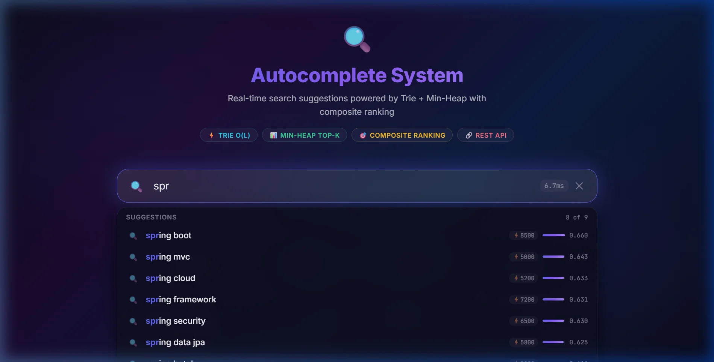
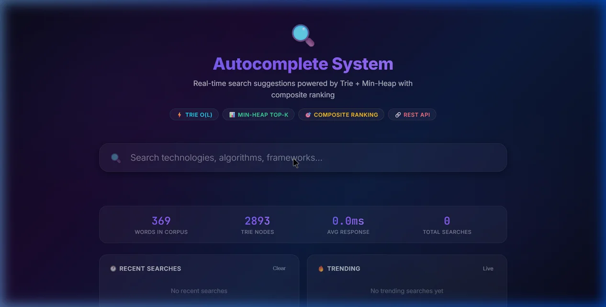
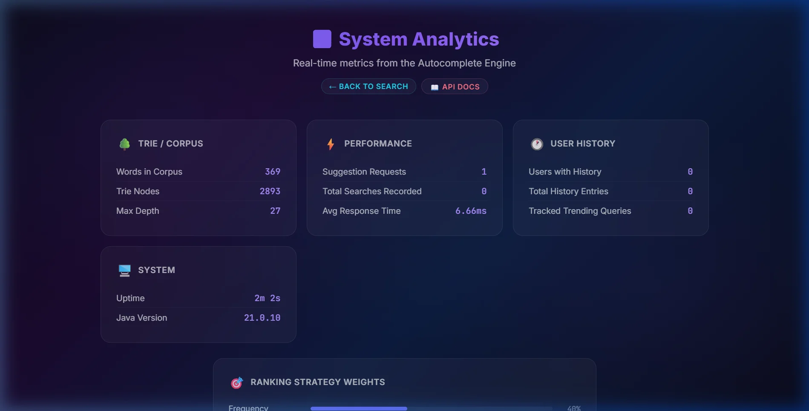
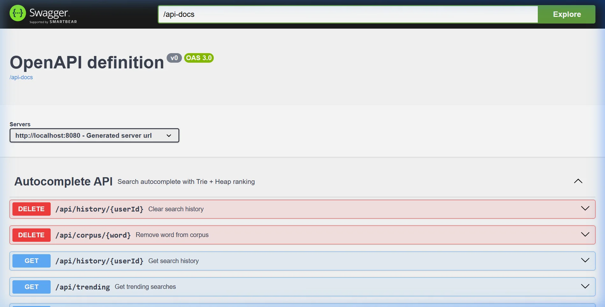

<p align="center">
  
  
  
  
</p>

<h1 align="center">🔍 Autocomplete Search Engine</h1>

<p align="center">
  <strong>A production-grade, real-time search autocomplete system built from scratch with custom data structures (Trie + Min-Heap), composite ranking algorithms, and a glassmorphism UI.</strong>
</p>

<p align="center">
  <em>Hybrid DSA × System Design portfolio project — no external search libraries used.</em>
</p>

<p align="center">
  
</p>

---

## Table of Contents

- [Why This Project?](#-why-this-project)
- [Screenshots](#-screenshots)
- [Features](#-features)
- [Architecture](#-architecture)
- [Core Data Structures](#-core-data-structures)
- [Ranking Algorithm](#-ranking-algorithm)
- [API Reference](#-api-reference)
- [Project Structure](#-project-structure)
- [Getting Started](#-getting-started)
- [Configuration](#%EF%B8%8F-configuration)
- [Testing](#-testing)
- [Scaling Discussion](#-scaling-discussion)
- [Tech Stack](#-tech-stack)
- [Author](#-author)

---

## 💡 Why This Project?

Most autocomplete tutorials stop at a basic Trie. Real search engines like Google, YouTube, and Amazon use a **multi-stage pipeline** combining prefix matching, ranking, personalization, and trending analysis.

This project bridges that gap — every component is **hand-implemented** to demonstrate deep understanding:

| Component | What You'll Find Here | Interview Level |
|---|---|---|
| **Trie** | Custom prefix tree with recursive deletion & garbage collection | DSA Core |
| **Min-Heap** | Array-backed binary heap with heapify-up/down from scratch | DSA Core |
| **Top-K Engine** | O(N log K) extraction — the classic interview optimization | DSA Advanced |
| **Composite Ranking** | Strategy Pattern with 4 weighted scoring dimensions | System Design |
| **Trending Service** | Sliding window counters with CAS-based concurrency | System Design |
| **Search History** | Bounded FIFO with GDPR-compliant deletion | System Design |

---

## 📸 Screenshots

### Search UI — Glassmorphism Theme with Prefix Highlighting

<p align="center">
  
</p>

> Type a prefix and see ranked suggestions with score breakdowns, frequency counts, and response time.

### Landing Page — Stats & Trending Dashboard

<p align="center">
  
</p>

> The landing page shows corpus size (369 words, 2893 Trie nodes), average response time, and recent/trending panels.

### Analytics Dashboard — System Metrics

<p align="center">
  
</p>

> Real-time analytics: Trie stats, performance metrics, user history counts, and ranking strategy weight visualization.

### Swagger API Docs — OpenAPI 3.0

<p align="center">
  
</p>

> Interactive API explorer with all endpoints documented — try requests directly from the browser.

---

## ✨ Features

### Core Engine
- **Custom Trie** — O(L) prefix matching with Unicode support, sparse `HashMap<Character, TrieNode>` child mapping, and recursive partial deletion with orphan node garbage collection
- **Custom Min-Heap** — O(log K) insert/extract built from a raw array, with dynamic resizing. No `PriorityQueue` used
- **Top-K Extraction** — O(N log K) optimal selection using Min-Heap, dramatically faster than O(N log N) sorting when K ≪ N
- **Composite Ranking** — 4-strategy weighted scoring engine using the Strategy Pattern (Frequency, Recency, Prefix Match, Personalization)

### Intelligence
- **Trending Searches** — Sliding window counter with time-decay, modeled after Twitter/Google Trends algorithms. Uses `ConcurrentHashMap` + `AtomicInteger` for lock-free concurrency
- **Per-User Personalization** — Bounded search history per user with frequency-based boosting
- **Logarithmic Frequency Dampening** — Prevents popular terms from dominating results (log(1 + freq) / log(1 + maxFreq))

### Frontend
- **Glassmorphism UI** — Animated gradients, backdrop blur, score visualization bars, prefix highlighting
- **150ms Debounced Input** — Prevents API flooding with `AbortController` for race condition handling
- **Live Analytics Dashboard** — Real-time metrics for corpus size, response times, trending queries, and ranking weights
- **Zero Dependencies** — Pure HTML5 / CSS3 / Vanilla JS

### API & DevOps
- **RESTful API** with full OpenAPI 3.0 / Swagger documentation
- **Spring Boot Actuator** — Health checks, metrics, and info endpoints
- **Pre-loaded Corpus** — 300+ technology terms across 9 categories with realistic frequency distributions

---

## 🏗 Architecture

```
┌──────────────────────────────────────────────────────────────────┐
│                        CLIENT (Browser)                         │
│  ┌─────────────┐  ┌──────────────┐  ┌───────────────────────┐   │
│  │  Search Bar  │  │  Suggestions │  │  Analytics Dashboard  │   │
│  │  (150ms      │  │  (Prefix     │  │  (Real-time metrics)  │   │
│  │   debounce)  │  │   highlight) │  │                       │   │
│  └──────┬───────┘  └──────▲───────┘  └───────────▲───────────┘   │
│         │                 │                      │               │
│         │   AbortController (race condition      │               │
│         │    cancellation)                        │               │
└─────────┼─────────────────┼──────────────────────┼───────────────┘
          │ GET /api/suggest │                      │ GET /api/analytics
          ▼                 │                      │
┌─────────────────────────────────────────────────────────────────┐
│                    SPRING BOOT APPLICATION                      │
│                                                                 │
│  ┌─────────────────────────────────────────────────────────┐    │
│  │              AutocompleteController (REST)               │    │
│  │  /api/suggest  /api/corpus  /api/history  /api/trending  │    │
│  └──────────────────────┬──────────────────────────────────┘    │
│                         │                                       │
│  ┌──────────────────────▼──────────────────────────────────┐    │
│  │              AutocompleteService (Orchestrator)          │    │
│  │  Ties together: Trie + RankingEngine + History + Trends  │    │
│  └──────┬──────────────┬───────────────┬──────────────┬────┘    │
│         │              │               │              │         │
│  ┌──────▼──────┐ ┌─────▼──────┐ ┌─────▼──────┐ ┌────▼──────┐  │
│  │    TRIE     │ │  RANKING   │ │  SEARCH    │ │ TRENDING  │  │
│  │  (Custom)   │ │  ENGINE    │ │  HISTORY   │ │ SERVICE   │  │
│  │             │ │            │ │            │ │           │  │
│  │ • insert    │ │ Strategies:│ │ • Bounded  │ │ • Sliding │  │
│  │ • search    │ │ • Frequency│ │   FIFO     │ │   window  │  │
│  │ • prefix    │ │ • Recency  │ │ • Per-user │ │ • Decay   │  │
│  │ • delete    │ │ • Prefix   │ │ • GDPR     │ │ • CAS     │  │
│  │             │ │ • Personal │ │   delete   │ │   atomic  │  │
│  │ O(L) ops    │ │            │ │            │ │           │  │
│  └─────────────┘ │ ┌────────┐ │ └────────────┘ └───────────┘  │
│                  │ │TOP-K   │ │                                │
│                  │ │ENGINE  │ │                                │
│                  │ │(MinHeap│ │                                │
│                  │ │O(NlogK)│ │                                │
│                  │ └────────┘ │                                │
│                  └────────────┘                                │
└─────────────────────────────────────────────────────────────────┘
```

### Request Pipeline

```
User types "spr"
    │
    ▼
1. Trie.getWordsWithPrefix("spr")              →  O(L + N) prefix retrieval
    │  Returns: [spring boot, spring framework, spring security, spring data jpa, ...]
    ▼
2. RankingEngine.rankAndSelect(candidates)      →  O(N × S) composite scoring
    │  Scores each candidate across 4 strategies:
    │    "spring boot"      → 0.40×0.98 + 0.25×0.43 + 0.20×0.85 + 0.15×0.60 = 0.762
    │    "spring framework" → 0.40×0.88 + 0.25×0.35 + 0.20×0.72 + 0.15×0.30 = 0.628
    │    ...
    ▼
3. TopKEngine.getTopK(scored, K=5)             →  O(N log K) Min-Heap extraction
    │  Maintains Min-Heap of size 5, discards lowest-scored
    ▼
4. Return Top-5 suggestions sorted by score descending
```

---

## 🧩 Core Data Structures

### 1. Trie (Prefix Tree)

A custom-built prefix tree for O(L) autocomplete lookups.

```
            (root)
           /   |   \
          j    p    s
         /     |     \
        a      y      p
       / \     |       \
      v   z   t        r
     /         |         \
    a          h          i
   / \         |           \
  (java)     o             n
  freq:9500  |              \
            n               g
             \
             (python)
             freq:9200
```

| Operation | Time | Space | Notes |
|---|---|---|---|
| `insert(word)` | O(L) | O(L) worst | Shared prefixes reduce actual space |
| `search(word)` | O(L) | O(1) | Exact match lookup |
| `startsWith(prefix)` | O(L) | O(1) | Prefix existence check |
| `getWordsWithPrefix(prefix)` | O(L + N) | O(N) | DFS from prefix node |
| `getWordsWithPrefix(prefix, max)` | O(L + M) | O(M) | Early termination at M results |
| `delete(word)` | O(L) | O(L) stack | Recursive bottom-up with orphan GC |

**Design Decisions:**
- `HashMap<Character, TrieNode>` over array — supports Unicode, not just a-z
- Recursive deletion with garbage collection — prevents memory leaks from orphaned branches
- Stores `lastAccessed` timestamp on each terminal node for recency ranking

### 2. Min-Heap (Binary Heap)

A generic, array-backed binary heap built from scratch — no `java.util.PriorityQueue`.

```
Array: [5, 15, 10, 20, 25]

         5              Index relationships:
       /   \            Parent(i) = (i-1) / 2
      15    10          Left(i)   = 2i + 1
     /  \               Right(i)  = 2i + 2
    20   25

Heapify-Up (Insert 3):          Heapify-Down (Extract Min):
  [5,15,10,20,25,3]              [25,15,10,20]
          3 → bubbles up                25 → sifts down
  [3,15,5,20,25,10]              [10,15,25,20]
```

| Operation | Time | Notes |
|---|---|---|
| `insert(element)` | O(log N) | Heapify-up from last position |
| `extractMin()` | O(log N) | Swap root ↔ last, heapify-down |
| `peek()` | O(1) | Return root without removal |
| `isValid()` | O(N) | Structural integrity validation |

### 3. Top-K Engine

Uses Min-Heap of size K to extract Top-K in O(N log K) — the optimal solution.

```
Processing N=10000 candidates for Top K=5:

  For each candidate:
    if heap.size < K        → insert                    [Fill phase]
    if candidate > heap.peek → extractMin + insert      [Replace phase]
    else                    → skip                      [Prune]

  Result: heap contains exactly the Top-5 highest scored items
```

**Why Min-Heap for Top-K (not Max-Heap)?**
- We need to discard the **smallest** of the current Top-K when a better candidate arrives
- Min-Heap keeps the smallest at the root → O(1) comparison, O(log K) replacement
- Max-Heap would require O(K) to find the minimum

**Performance comparison for K=5, N=10,000:**
| Approach | Time | Operations |
|---|---|---|
| Sort all (naive) | O(N log N) | ~133,000 |
| **Min-Heap Top-K** | **O(N log K)** | **~23,000** |
| Speedup | | **~5.7×** |

---

## 📊 Ranking Algorithm

The final score for a suggestion is a **weighted sum of normalized factors** — each implemented as a pluggable Strategy:

```
Score = (0.40 × Frequency) + (0.25 × PrefixMatch) + (0.20 × Recency) + (0.15 × Personalization)
```

| Strategy | Weight | Formula | Range | Purpose |
|---|---|---|---|---|
| **Frequency** | 0.40 | `log(1 + freq) / log(1 + maxFreq)` | [0, 1] | Popularity with logarithmic dampening |
| **Prefix Match** | 0.25 | `prefix.length / word.length` | (0, 1] | Tighter matches rank higher |
| **Recency** | 0.20 | `1 / (1 + timeDelta / decayConstant)` | (0, 1] | Recently searched = likely relevant |
| **Personalization** | 0.15 | `log(1 + userFreq) / log(1 + maxUserFreq)` | [0, 1] | Per-user search history boost |

> **Weights are fully configurable** via `application.yml` — no code changes required.

### Why Not Just Sort by Frequency?

Single-factor ranking creates a poor user experience:
- `"java"` would **always** beat `"javafx"` regardless of user intent
- New terms could never surface (frequency = 0)
- No personalization possible
- No recency signal

---

## 📡 API Reference

Base URL: `http://localhost:8080/api`

### Suggestions

```http
GET /api/suggest?q={prefix}&limit={n}&userId={id}
```

| Param | Type | Default | Description |
|---|---|---|---|
| `q` | string | *required* | Search prefix |
| `limit` | int | 5 | Max suggestions (capped at 10) |
| `userId` | string | *optional* | Enables personalized ranking |

**Response:**
```json
{
  "prefix": "spr",
  "suggestions": [
    {
      "word": "spring boot",
      "score": 0.762,
      "frequency": 8500,
      "scoreBreakdown": {
        "frequency": 0.98,
        "prefix_match": 0.43,
        "recency": 0.85,
        "personalization": 0.60
      }
    }
  ],
  "totalMatches": 12,
  "responseTimeMs": 1.247
}
```

### Corpus Management

```http
POST /api/corpus                        # Add word: { "word": "spring", "frequency": 100 }
DELETE /api/corpus/{word}               # Remove word from Trie
GET /api/search?q={word}                # Exact word lookup
```

### Search History

```http
POST /api/history/{userId}?query={q}&selected={bool}   # Record search
GET /api/history/{userId}?limit={n}                     # Get user history
DELETE /api/history/{userId}                             # GDPR: clear history
```

### Trending & Analytics

```http
GET /api/trending?limit={n}             # Global trending queries
GET /api/analytics                      # System-wide metrics
```

> 📖 **Full interactive docs** at [localhost:8080/swagger-ui.html](http://localhost:8080/swagger-ui.html) when running locally.

---

## 📂 Project Structure

```
autocomplete-system/
├── src/main/java/com/autocomplete/
│   ├── AutocompleteApplication.java          # Spring Boot entry point
│   ├── config/
│   │   └── DataStructureConfig.java          # Trie bean configuration
│   ├── controller/
│   │   ├── AutocompleteController.java       # REST API (6 endpoint groups)
│   │   └── PageController.java               # Thymeleaf page routing
│   ├── datastructure/                        # ← HAND-BUILT DSA (no libraries)
│   │   ├── Trie.java                         # Prefix tree (471 lines)
│   │   ├── TrieNode.java                     # Node with frequency + timestamp
│   │   ├── MinHeap.java                      # Binary heap from array (355 lines)
│   │   └── TopKEngine.java                   # O(N log K) extraction
│   ├── ranking/                              # ← STRATEGY PATTERN
│   │   ├── RankingStrategy.java              # Strategy interface
│   │   ├── FrequencyRankingStrategy.java     # Log-dampened popularity
│   │   ├── RecencyRankingStrategy.java       # Inverse time-decay
│   │   ├── PrefixMatchRankingStrategy.java   # Prefix tightness scoring
│   │   ├── PersonalizationRankingStrategy.java # Per-user boost
│   │   ├── RankingEngine.java                # Composite orchestrator
│   │   ├── RankingContext.java               # Builder pattern context
│   │   └── ScoredWord.java                   # Scored result DTO
│   ├── history/
│   │   ├── SearchHistory.java                # Bounded per-user FIFO
│   │   ├── SearchEntry.java                  # History entry model
│   │   └── TrendingService.java              # Sliding window trending
│   ├── service/
│   │   ├── AutocompleteService.java          # Core orchestration layer
│   │   └── CorpusInitializer.java            # 300+ term seed data
│   ├── model/                                # API request/response DTOs
│   │   ├── SuggestionResponse.java
│   │   ├── AnalyticsResponse.java
│   │   ├── CorpusRequest.java
│   │   └── ErrorResponse.java
│   └── exception/
│       └── GlobalExceptionHandler.java       # Centralized error handling
├── src/main/resources/
│   ├── application.yml                       # All configurable parameters
│   ├── static/
│   │   ├── css/style.css                     # Glassmorphism theme
│   │   └── js/
│   │       ├── app.js                        # Application entry
│   │       ├── api.js                        # API client + AbortController
│   │       ├── searchbar.js                  # Debounced input handling
│   │       └── suggestions.js                # Dropdown rendering
│   └── templates/
│       ├── index.html                        # Search UI
│       └── analytics.html                    # Live dashboard
├── src/test/java/com/autocomplete/
│   ├── datastructure/
│   │   ├── TrieTest.java                     # Trie unit tests
│   │   ├── MinHeapTest.java                  # Heap property verification
│   │   └── TopKEngineTest.java               # Top-K correctness
│   ├── ranking/
│   │   └── RankingEngineTest.java            # Composite scoring tests
│   └── controller/
│       └── AutocompleteControllerIntegrationTest.java
├── pom.xml
└── README.md
```

---

## 🚀 Getting Started

### Prerequisites

- **Java 17** or higher ([Download](https://adoptium.net/))
- **Maven 3.8+** (included via Maven Wrapper)

### Run Locally

```bash
# Clone the repository
git clone https://github.com/naamsanamone/autocomplete-system.git
cd autocomplete-system

# Start the application (Maven Wrapper included — no Maven install needed)
./mvnw spring-boot:run
```

### Access Points

| URL | Description |
|---|---|
| [localhost:8080](http://localhost:8080) | Search UI |
| [localhost:8080/analytics](http://localhost:8080/analytics) | Live Analytics Dashboard |
| [localhost:8080/swagger-ui.html](http://localhost:8080/swagger-ui.html) | Interactive API Docs |
| [localhost:8080/actuator/health](http://localhost:8080/actuator/health) | Health Check |

---

## ⚙️ Configuration

All parameters are tunable in `application.yml` — no code changes required:

```yaml
autocomplete:
  max-suggestions: 10              # Max results per API call
  default-suggestions: 5           # Default if limit not specified
  max-history-per-user: 100        # Bounded history (memory safety)
  trending-window-minutes: 60      # Decay cycle interval

  ranking:                         # Weights must sum to 1.0
    frequency-weight: 0.40
    recency-weight: 0.20
    prefix-match-weight: 0.25
    personalization-weight: 0.15
```

---

## 🧪 Testing

```bash
# Run all tests
./mvnw test

# Run specific test class
./mvnw test -Dtest=TrieTest
./mvnw test -Dtest=MinHeapTest
./mvnw test -Dtest=TopKEngineTest
./mvnw test -Dtest=RankingEngineTest
```

### Test Coverage

| Module | Tests | What's Verified |
|---|---|---|
| `TrieTest` | Insert, search, prefix, delete, edge cases | Correctness + recursive GC |
| `MinHeapTest` | Insert, extract, ordering, resize, validation | Heap property invariant |
| `TopKEngineTest` | Top-K extraction, K > N, empty input | O(N log K) correctness |
| `RankingEngineTest` | Composite scoring, weight distribution | Strategy composition |
| `ControllerIntegrationTest` | Full HTTP pipeline | End-to-end API contracts |

---

## 📈 Scaling Discussion

> *How would you scale this to handle 100K QPS across multiple servers?*

| Challenge | Single-Server (This Project) | Production Scale |
|---|---|---|
| **Trie Storage** | In-memory `HashMap` nodes | Distributed Trie sharded by prefix range |
| **Ranking** | In-process strategy pipeline | Pre-computed scores in Redis Sorted Sets |
| **Trending** | `ConcurrentHashMap` + `AtomicInteger` | Kafka → Flink stream processing + HyperLogLog |
| **History** | `ConcurrentHashMap<userId, Deque>` | User service + Cassandra/DynamoDB |
| **Serving** | Single Spring Boot instance | Kubernetes pods behind API Gateway + CDN |
| **Concurrency** | CAS-based `AtomicInteger` | Redis Lua scripts for atomic operations |
| **Cache** | None (sub-ms response) | L1: Caffeine local, L2: Redis distributed |

---

## 🛠 Tech Stack

| Layer | Technology | Purpose |
|---|---|---|
| **Language** | Java 17 | Records, sealed classes, pattern matching |
| **Framework** | Spring Boot 3.2.5 | Dependency injection, REST, actuator |
| **Templating** | Thymeleaf | Server-side rendered pages |
| **Validation** | Jakarta Validation | Request body validation |
| **API Docs** | SpringDoc OpenAPI 3.0 | Swagger UI generation |
| **Build** | Maven (with Wrapper) | Dependency management, lifecycle |
| **Testing** | JUnit 5 + Spring Boot Test | Unit + integration tests |
| **Frontend** | HTML5 / CSS3 / Vanilla JS | Zero-dependency UI |

### Design Patterns Used

| Pattern | Where | Why |
|---|---|---|
| **Strategy** | `RankingStrategy` + 4 implementations | Open/Closed: add ranking factors without modifying engine |
| **Builder** | `RankingContext.Builder` | Clean construction of complex context objects |
| **Factory Method** | `SearchEntry.now()` | Encapsulated creation with automatic timestamping |
| **Composite** | `RankingEngine` | Orchestrates multiple strategies into one score |
| **Template Method** | `AutocompleteService.suggest()` | Fixed pipeline with pluggable components |

---

## 👨‍💻 Author

**Sai Venkat** — Java Full Stack Developer

- GitHub: [@naamsanamone](https://github.com/naamsanamone)

---

<p align="center">
  <sub>Built with ☕ and hand-coded data structures. No search libraries were harmed in the making of this project.</sub>
</p>
